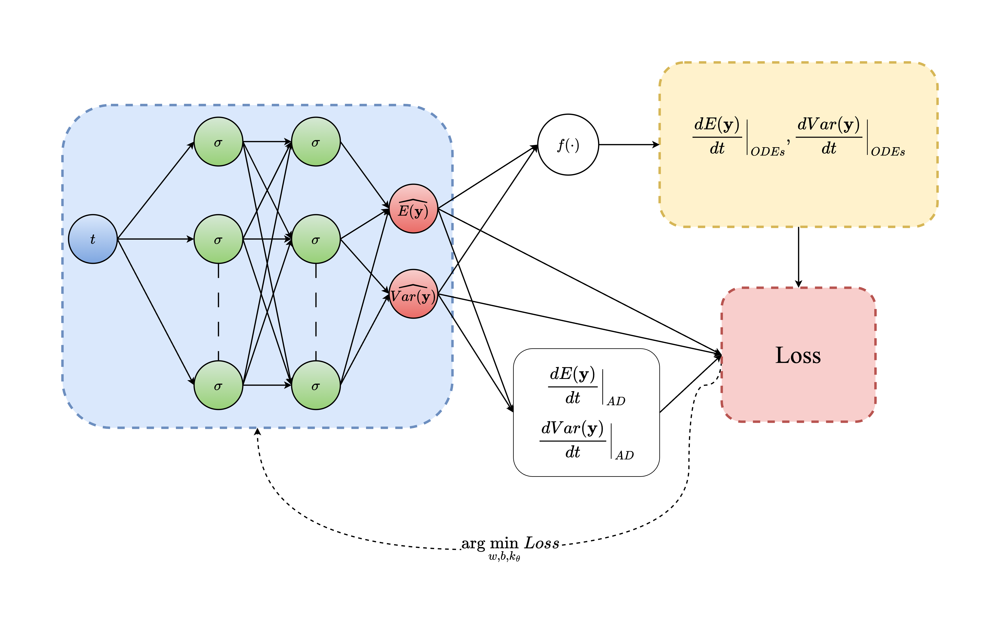

# Distributional Physics-Informed Neural Networks (D-PINNs)

D-PINN is a novel algorithm designed to enable statistical modeling within Physics-Informed Neural Networks (PINNs). Unlike traditional PINNs, which often focus on point estimates, D-PINNs integrate distributional assumptions directly into the optimization process. This integration allows D-PINNs to handle both forward and inverse problems by estimating state variables and system parameters via probability distributions, thereby effectively propagating uncertainty and interindividual variability observed in state variables through to parameter estimation and vice versa. The framework utilizes neural networks to predict statistical measures, such as the mean and variance, of state variables over time, and these predictions are then sampled to derive distributions for the variables and parameters. To demonstrate its capability to solve inverse and forward problems, the algorithm was applied to a pharmacokinetic modeling problem using a three-compartment model to simulate drug mass transfer in the body. Benchmarking of D-PINNs against a state-of-the-art algorithm, Hamiltonian Monte Carlo (HMC), highlighted the prediction accuracy and speed of convergence of the proposed methodology. The results suggest that D-PINNs offer a robust and efficient approach for incorporating statistical modeling into PINNs, significantly improving their applicability in fields such as pharmacokinetics, where incorporation of distributions to describe the population is crucial.

This repository provides the code that implements D-PINNS for both forward and inverse problems on an application of a simple 3-compartmental pharmacokinetic model. For more information about the theoretical background and the application of D-PINNs please refer to **D-PINNS: A simple algorithm for facilitating statistical modelling in PINNs**.

The [inverse_problem](inverse_problem)
folder contains the code and files related to solving inverse problems using D-PINNs. It includes the implementation of the three-compartmental pharmacokinetic model and the necessary functions for estimating the system parameters based on observed data. 

- `PK_system_data_generation.py`: This file implements the three-compartmental pharmacokinetic model, which describes the drug mass transfer in the body. It includes functions for simulating the drug concentration over time and generates train_data used for training D-PINN.

- `Inverse_D-PINN.py`: Implements the training of D-PINN and estimates the parameters of distribution of the pharmacokinetic model's kinetic parameters.

- `Goodness_of_fit_vs_iterations_vs_N.py`: Creates a plot with the evolution of goodness of fit with respect to the numbers of training iterations and the number of sampled points from the assumed distributions of state variables and kinetic parameters.

- `Predictions_vs_Observations_Plot.py`: Creates a plot with the predictions of the D-PINN for the mean value and variance of state variable over time against the observed data.

- `prior_vs_posterior.py`: Creates a plot that compares the prior distributions of the kinetic parameters with those estimated from both D-PINNs and HMC frameworks.

The [forward_problem](forward_problem) folder, on the other hand, focuses on solving forward problems using D-PINNs. It contains the code and files for simulating the drug mass transfer in the body using the three-compartmental model. This includes functions for predicting the mean and variance of state variables over time. Specifically, the folder contains the following code scripts that reproduce the results of the forward problem.

- `PK_system_for_forward.py`: implements the pharmacokinetic model, exactly as `PK_system_data_generation.py`.

- `forward_D-PINN.py`: Implements the training of D-PINN, ut this time the parameters of distribution of the kinetic parameters are fixed to their original values.

- `forward_plots.py`: Creates a plot of the concentration-time profiles (mean and variance) derived from the numerical slution of the ODEs versus the predictions profiles that derive from the trained D-PINN.

Each folder consists of subfolders that contain the final plots and results that are also reported in the paper.

